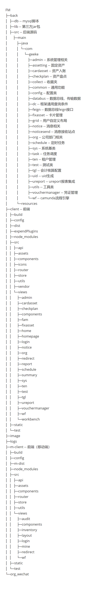
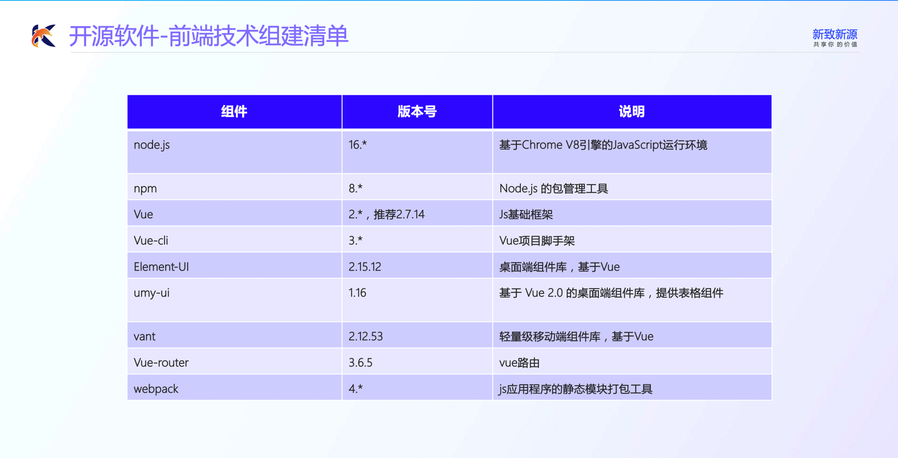
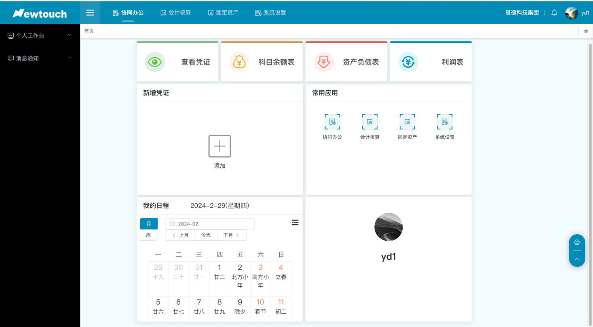
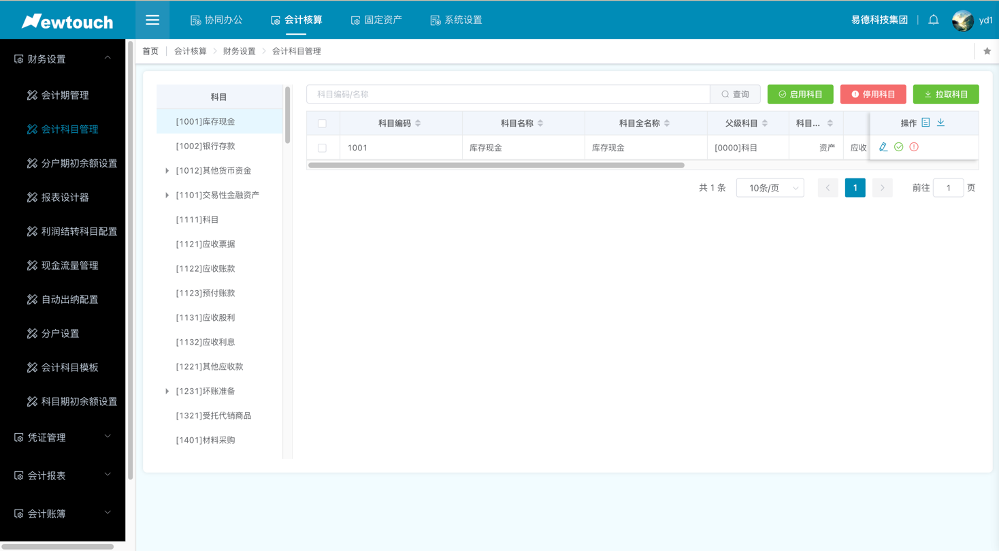
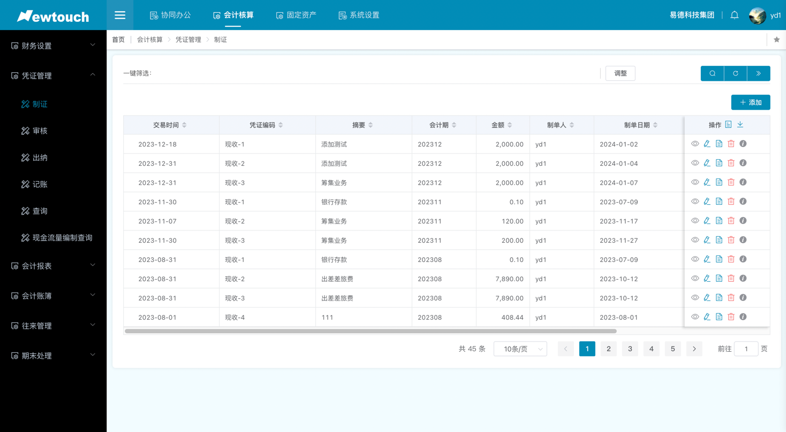
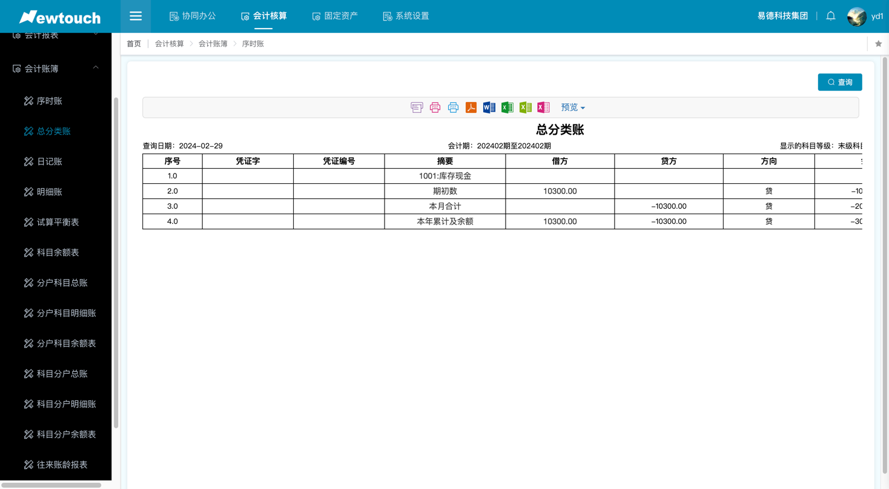

# 项目介绍

天天开源秉持开源、专业、协作的理念，致力于打造中国应用管理软件开源生态，面向医疗、企业、教育三大行业信息化需求，提供优质的开源软件产品与解决方案。

作为中国应用管理软件开源的引领者，天天开源于2022年6月发布开源医疗软件平台OpenHIS.org.cn，于2023年6月发布开源企业软件平台OpenCOM.com.cn。您可以自行登录官网平台获取开源软件源代码、安装包和技术文档等。

我们欢迎多元化合作方式，包括但不仅限于开源产品协作开发、信息化产品协作落地、行业活动合作举办、客户合作共享、客户产品需求协作支持等方式。欢迎联系我们咨询合作！

本开源项目是OpenCOM发布的财务管理系统模块，模版包含：财务设置、凭证管理、会计报表、会计帐簿、往来管理、期末处理。
如需要其他产品源码，可访问天天开源企业官网。

# 官网地址
开源企业：http://opencom.com.cn/?site=gitee

# 产品体验
地址：http://61.172.179.26:8099/fm/#/login   yd1  cDLG@336

# 联系我们
* 技术问题可扫码进群提问

* 产品和商务合作问题请加微沟通

* 请关注开源公众号以便获得最新咨询

# 源码结构

# 技术架构
* 前端技术选型

* 后端技术选型

# 启动部署
请参考代码目录中名为【产品源代码运行部署指南v1.0】文档

# 系统截图

